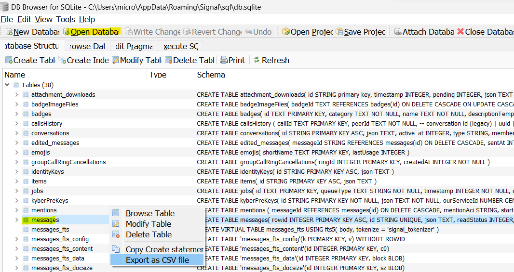

# signal_sqlite_md

Converts messages from a Signal SQLite database export to Markdown.

Unlike [signal_md](https://github.com/thephm/signal_md) which requires output from `signald`, this tool requires nothing beyond this Python script, some configuration, and a tool to export the DB.

## Disclaimer

I should've called it `signal_sqlite_csv_md` because the script doesn't read directly from the SQLite DB, instead it parses a CSV export from it. I tried directly accessing the DB and gave up 🤣

## Context

A big shoutout to Florian Engel whose post `[1]` saved me hours 🤗.

The SQLite DB is encrypted but it's easy to decrypt because you have the key! 

Another approach would be to query the SQLite DB directly on device but that's a future thing for me. A good reference is https://github.com/idanlevin/signal-query

## Regression

The attachments are not in the DB, they're stored in the local file system in a series of folders with 2 digit Hex labels. The files have names like "`000ec9a54abe93416284f83da2f9f8d124778f22191d9422ed9829de2b22c1b7`" with no suffix. In my case, the files are stored in `C:\Users\micro\AppData\Roaming\Signal\attachments.noindex`.

In previous versions of Signal Desktop for Windows, the attachments were not encrypted. The current version of Signal Desktop encrypts the attachment files and obfuscates their filename in the database. 

I haven't figured out a way to decrypt the attachment files. So, at this point you need to manually download each attachment in Signal Desktop, save the files and modify the Markdown output from this tool to the filename.

## Dependencies

The code in this repo relies heavily on my [message_md](https://github.com/thephm/message_md) classes which contain generic `Message`, `Person`, `Group` and other classes and the methods to convert messages to Markdown files. Be sure to read the `README` and the configuration guide for that repo first. 

## References

1. [Extracting Messages from Signal Desktop](https://www.tc3.dev/posts/2021-11-02-extract-messages-from-signal/) by [Florian Engel](https://www.linkedin.com/in/engelflorian) guided my way
2. [DB Browser for SQLite](https://sqlitebrowser.org/dl/) to get your data
3. [message_md](https://github.com/thephm/message_md) upon which this tool depends

## High level process

1. Get your Signal data
2. Configure this tool
3. Run this tool
4. Be happy

## It's your data, go get it!

The tool needs three files of date exported from Signal's SQLite database:

1. `messages.csv` - the actual messages
2. `conversations.csv`  - maps `conversation-id` to individuals and groups of people
3. `message_attachments.csv` - metadata on each attachment

**Before you start**

You first need to install DB Browser for SQLite ref. [2]

*NOTE: I had to try multiple older versions before I got one that would open the file. The one that worked for me was `v3.13`.*

The steps below desribe how to get the message data out of Signal.

**Steps**

I created a helper shell script `signal.sh` that walks you through these steps. It's described further down this page.

1. Get your decrypted SQLite DB key
    - On Windows, install [Signal Backup Tools](https://github.com/bepaald/signalbackup-tools) and run `signalbackup-tools_win.exe --showdesktopkey --ignorewal`
4. Find the **path** to your Signal `db.sqlite` database file
    - For me, it was here: `C:\Users\micro\AppData\Roaming\Signal\sql\`
5. Launch "DB Browser for SQLite (SQLCipher)" -- not the one without `(SQLCipher)`
6. Click "Open Database"
7. Choose `Raw key` from the menu to the right of the "Password" field
8. In the "Password" field, type `0x` and then paste the **key** you found in step 2
9. Right click on "`messages`" and choose "Export as CSV file"



9. Right click on "`conversations`" and click "Export as CSV file"
10. Right click on "`message_attachments`" and click "Export as CSV file"

## Setting up the config files

The next step is to configure this tool. 

You need to define each person that you communicate with in `people.json` and the groups in `groups.json`. This way the tool can associate each message with the person that sent it and who it was sent to.

Samples of these configuration files are in the `message_md` repo [here](https://github.com/thephm/message_md/tree/main/config) upon which this tool [depends](#dependencies).

This part is tedious the first time and needs to be updated when you add new contacts or Groups in Signal, i.e. a pain.

Someday I can automate this but for now, no pain, no gain 🙂. 

The next sections describes how people are identified and where to find the identifiers for groups. 

### People

People are found in the `conversations.csv` file via their phone number in the `e164` column. The `conversations.csv` file is assumed to be under the source folder 

### Groups

1. Open the `conversations.csv` file in your favorite editor
2. Look at the first row

```
id,json,active_at,type,members,name,profileName,profileFamilyName,profileFullName,e164,serviceId,groupId,profileLastFetchedAt
```

3. If there's a `groupId` field value on a given row, then that's a group
    - the `name` field will tell you the name of the group

```
""id"":""a1760c87-d3d0-40f6-9992-ac0426efcc14""
""groupId"":""FdibKUgQIZPilWQu3jbgEB+tajc3RUKuoyYNZp4bRhQ=""
""name"":""Family"
```

4. Add the corresponding row to `groups.json`:
    - set group `id` to the `id` from `conversations.csv`
    - set the `conversation-id` to the `groupID` from  Step 3
    - set `slug` to a one-word or hyphenated keyword (`slug`) for this group 
    - set `description` to the `name` either the name from `conversations.csv` or something else e.g. "Family"
     
4. Repeat Steps 3 and 4 for every row

## Using signal_sqlite_md

Once you have the CSV export files and you your `people.json` and `groups.json` configured, you're finally ready to run this tool.

The [command line options](https://github.com/thephm/message_md#command-line-options) are described in the [message_md](https://github.com/thephm/message_md) repo.

Example:

```
# python3 signal_sqlite_md.py -c ../../dev-output/config -s ../../signal_sqlite/ -f messages.csv -d -o ../../dev-output -m spongebob -b 2023-12-20
```

where: 

- `c`onfig settings are in `../../dev-output/config`
- `s`ource folder is `../../signal_sqlite`
- `f`ile of CSV messages is `messages.csv` in the `s`ource folder
- `o`utput the Markdown files to `../../dev-output`
- `m`y slug is `spongebob`
- `b`egin the export from `2023-12-20`

## Helper bash script

The file `signal.sh` is a small shell script which makes running the tool a little easier. It simply calls the "Signal Backup Tools" for you and shows the encryption key so you can copy and paste it. It also describes the steps so you don't have to come back to this page to find them. I run this script in Ubuntu on Windows Subsystem for Linux (WSL). 

Before running the script, check that it has e`x`ecution permissions and update the constants defined at the top of the file:

```
# this is your slug
ME=bob

# location of 'signalbackup-tools_win.exe' is
DIR=/mnt/c/Users/micro/OneDrive/Desktop

# where you place the exported SQLite output files in steps 6 and 8
DATA_DIR=/mnt/c/data/signal_sqlite

# location of the Python script
PY_DIR=/mnt/c/data/github/signal_sqlite_md

# configuration for signal_sqlite_md
CONFIG_DIR=/mnt/c/data/dev-output/config

# location to put the output Markdown files from signal_sqlite_md
OUTPUT_DIR=/mnt/c/data/dev-output
```

## License

This project is licensed under the MIT License - see the [LICENSE](LICENSE.md) file for details.